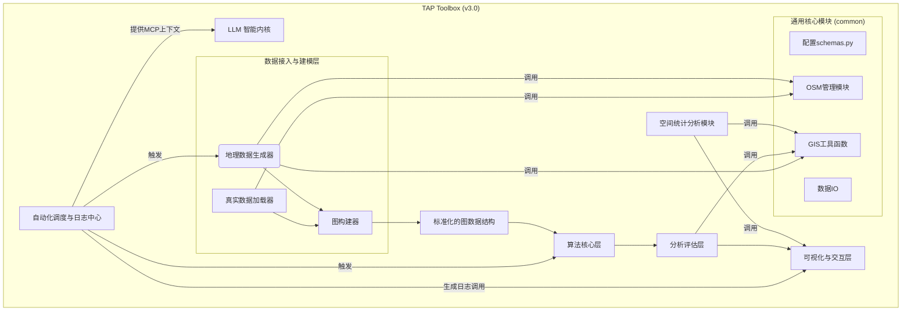

### **修订记录 (Change Log)**

| 版本 (Version) | 日期 (Date) | 变更内容 (Change Description) | 作者 (Author) | 审批人 (Approved By) |
| :--- | :--- | :--- | :--- | :--- |
| 1.3 | 2025年8月15日 | 新增“OSM管理模块”作为通用核心组件。 | Gemini | (待审批) |
| 1.2 | 2025年8月15日 | 根据QWEN AI的详细评审意见进行全面修订... | Gemini | 郭宏斌 |
| 1.1 | 2025年8月15日 | 初版创建... | Gemini | (待审批) |

---
**版本**: 1.3
**状态**: 草案

# **系统架构设计 (System Architecture)**

## 1. 核心架构理念

本系统采用分层解耦的模块化架构。其核心思想是将复杂的TAP流程拆分为独立的、职责单一的组件。各组件间通过标准化的数据结构（如GeoDataFrame, 标准化的图对象）进行通信，确保了系统的高度灵活性、可扩展性和可维护性。

一个顶层的“自动化调度与日志中心”负责驱动整个工作流，并为内置的LLM生成可供学习的图文日志。

## 2. 系统架构图 (v3.2)

## 3. 核心组件职责

*   **自动化调度与日志中心 (Orchestration & Logging)**: 
    *   整个系统的“大脑”，负责根据配置文件驱动自动化实验流程。
    *   为生成图文日志，它会调用**可视化与交互层**来创建和保存截图。
    *   负责根据**模型上下文协议(MCP)**，将格式化的图文日志提供给**LLM智能内核**。

*   **数据接入与建模层 (Data Ingestion & Modeling)**:
    *   **真实数据加载器**: 负责读取用户提供的真实数据文件。
    *   **地理数据生成器**: 负责程序化地生成多样化的合成及半合成测试数据。
    *   **图构建器**: 负责将原始数据转换为下游算法可用的、标准化的图数据结构。

*   **通用核心模块 (Common Utilities)**:
    *   **OSM管理模块**: 新增。负责所有与OpenStreetMap数据的交互，包括API数据获取、本地文件读取和数据缓存，为其他模块提供统一的OSM数据服务。
    *   **(其他通用模块)**: 如配置Schemas, GIS工具函数, 数据IO等。

*   **算法核心层 (Algorithm Core)**:
    *   一个可插拔的算法库，容纳所有不同的领土划分算法实现（如Metis, SKATER等）。
    *   所有算法都遵循一个统一的接口，接收一个标准图对象，返回一个带分区结果的图对象。

*   **分析评估层 (Analysis & Evaluation)**:
    *   负责用一套客观、标准化的指标（如平衡性、紧凑性等）来评估算法的输出结果。

*   **可视化与交互层 (Visualization & Interaction)**:
    *   双重职责：1. 为Web应用提供交互式图表和地图。2. 为日志中心提供自动化的、可保存的静态图表和地图生成服务。

*   **空间统计分析模块 (Spatial Statistics)**:
    *   一个通用的、横向的服务模块，提供高级空间分析功能（如雷普利K函数）。
    *   其分析结果（如K函数图）本身也需要可视化，因此它也会调用**可视化与交互层**。

*   **LLM 智能内核 (LLM Core)**:
    *   接收由调度中心提供的、符合MCP格式的图文上下文。
    *   根据用户指令，执行分析、解释、对比或设计评估等智能任务。
